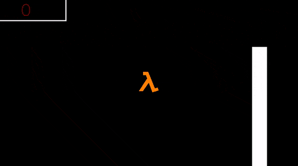

# demo-flappy-lambda

Игра «Flappy Lambda».



## Сборка и запуск

Клонируйте репозиторий:

```
git clone https://github.com/cmc-haskell-2017/demo-flappy-lambda.git
cd demo-flappy-lambda
```

Соберите проект при помощи [утилиты Stack](https://www.haskellstack.org):

```
stack setup
stack build
```

Собрать проект и запустить игру можно при помощи команды

```
stack build && stack exec demo-flappy-lambda
```

## Задание

В качестве задания к [лекции «Ленивые вычисления»](https://youtu.be/MUfncxhDZK0) требуется
реализовать [функцию `collision`](https://github.com/cmc-haskell-2017/demo-flappy-lambda/blob/master/src/FlappyLambda.hs#L218-L221).

Как только вы реализуете эту функцию, игра станет значительно сложнее!
